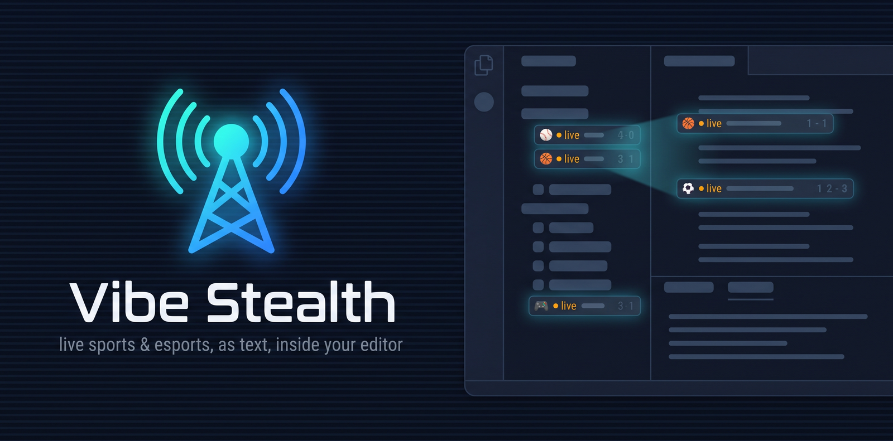

# Vibe Stealth — 스포츠·e스포츠 실시간 문자중계



**업무 중에도 조용히, 에디터 안에서 경기를 따라가세요.** Vibe Stealth는 KBO·K리그 문자중계와 LCK를 비롯한 실시간 스포츠·e스포츠를 VS Code 안의 조용한 텍스트 티커로 바꿔줍니다. 영상도, 소리도, 포커스를 빼앗는 별도 창도 없이 — 짧은 중계 한 줄 한 줄이 출력 채널(Output Channel)에 흘러들고, 상태 표시줄에는 간결한 스코어만 뜹니다. 액티비티 바 트리에서 경기를 골라 팔로우하면, 코드를 계속 짜는 동안 중계가 뒤에서 알아서 돌아갑니다.

브라우저 탭도, 스트리밍 창도, 두 번째 모니터도 없이 "지금 스코어 어떻게 됐지?"만 알고 싶은 분들을 위해 만들었습니다.

> 아직 Visual Studio Marketplace에 등록되지 않았습니다. 소스에서 `npm run package`로 `.vsix`를 만든 뒤 **Extensions: Install from VSIX…**로 설치할 수 있습니다.

## 주요 기능

- **실시간 경기 트리** — 액티비티 바에서 리그를 펼쳐 진행 중인 경기를 확인하고, 클릭 한 번 또는 명령 팔레트로 바로 팔로우.
- **텍스트 문자중계** — 팔로우한 경기의 중계 라인이 전용 "Vibe Stealth Relay" 출력 채널에 시간 스탬프와 함께(원하면 종목 이모지와 함께) 흘러듭니다.
- **트리에서 보는 실시간 경기 상황** — 진행 중인 팔로우 경기를 펼치면 주자·볼카운트, 라인업, 챔피언 밴픽이 폴링마다 사이드바 안에서 바로 갱신됩니다(웹뷰·팝업 없이).
- **두 단계 상세도** — 기본값 `summary`는 조용하게(타석당 한 줄, 주요 이벤트만), `detailed`는 투구별 야구·NHL 슛·체크·축구 주요 이벤트·LoL 킬 피드까지 더합니다.
- **실제 팀·리그 로고** — 트리 행에 진짜 엠블럼을 표시합니다. 한 번만 내려받아 로컬에 저장한 뒤 오프라인에서도 재사용하며, 끌 수도 있습니다.
- **간결한 상태 표시줄 스코어** — 가장 관심을 둘 만한 경기(진행 중 > 방금 종료 > 예정) 하나를 `AWY 3:2 HOM · Q4` 형태로만, 색이나 이모지 없이 보여줍니다.
- **한국 스포츠 우선** — 네이버 스포츠 기반의 진짜 KBO **문자중계**(투구 단위)와 K리그1 이벤트 중계를 원래의 한국어 그대로 제공합니다.
- **키(API 토큰) 없이 기본 동작** — KBO, K리그, LCK/LPL/LEC/MSI/롤드컵/First Stand, MLB, NHL, ESPN의 축구·NFL·NBA·WNBA 중계까지 별도 설정 없이 바로.
- **선택적 e스포츠 스코어 티커** — 무료 PandaScore API 토큰을 등록하면 LoL, 발로란트, CS2, 도타 2의 매치·맵 스코어도 추적합니다.
- **참가 시 백필(backfill)** — 이미 진행 중인 경기를 팔로우하면 맥락 파악에 필요한 최근 플레이 몇 개만, 전체 히스토리는 쏟아내지 않습니다.
- **워크스페이스 단위 유지** — 창을 새로고침해도 팔로우 목록이 그대로 유지됩니다.

## 지원 리그

| 제공처 | 리그 | 제공 내용 | 접근 방식 |
|---|---|---|---|
| **네이버 스포츠** | KBO리그 ⚾, K리그1 ⚽ | 진짜 한국어 **문자중계**: KBO는 투구 단위, K리그는 골·카드 등 주요 이벤트 중계. 원래부터 한국어. | 키 불필요, **비공식** |
| **LoL Esports** | LCK, LPL, LEC, MSI, 롤드컵(Worlds), First Stand 🎮 | 시리즈/맵 스코어 티커(Game 1, Game 2… 맵 승수). `detailed`에서는 실시간 킬 피드([상세도](#상세도) 참고). | 키 불필요(라이엇 공개 웹 게이트웨이 키), **비공식** |
| **MLB StatsAPI** | MLB ⚾ | 공식 타석 단위 중계, `detailed`에서는 투구 단위 | 키 불필요, **공식** |
| **NHL** | NHL 🏒 | 공식 골·페널티·피리어드 경계·경기 종료. `detailed`는 슛·체크·스틸·턴오버 추가 | 키 불필요, **공식** |
| **ESPN** | NFL 🏈, NBA 🏀, WNBA 🏀, FIFA 월드컵 ⚽, 프리미어리그, 라리가, 세리에 A, 분데스리가, 리그 1, MLS, UEFA 챔피언스리그 | 플레이바이플레이/코멘터리 피드, 득점 플레이 강조. `detailed` 축구는 구조화된 주요 이벤트 추가 | 키 불필요, **비공식** |
| **PandaScore** | LoL, CS2, 도타 2, 발로란트 🎮 | **스코어 티커만**(맵 결과) — 라운드/킬 단위 코멘터리는 없음 | 무료 API 토큰 필요, 비공식 |

`vibeStealth.leagues.enabled`에 쓰는 리그 id는 `provider:league` 형식입니다 — 예: `naver:kbo`, `lolesports:lck`, `mlb:mlb`, `nhl:nhl`, `espn:eng.1`, `pandascore:lol`.

## 빠른 시작

1. 액티비티 바에서 Vibe Stealth 아이콘을 클릭합니다.
2. 제공처와 리그를 펼쳐 진행 중이거나 예정된 경기를 선택합니다.
3. 경기 행을 클릭하거나(또는 명령 팔레트에서 **Follow Game** 실행) 팔로우하면, 중계 채널이 자동으로 열리고 곧바로 중계가 흘러듭니다.
4. 상태 표시줄의 스코어를 언제든 클릭하면 팔로우 중인 경기로 이동하거나 언팔로우할 수 있습니다.
5. LoL/발로란트/CS2/도타 2 스코어도 함께 보고 싶다면, **Vibe Stealth: Set PandaScore API Token (enables esports)** 명령을 실행하고 PandaScore 계정의 무료 토큰을 붙여 넣으세요. 토큰을 등록하기 전까지 PandaScore 항목은 트리에 표시되지 않습니다.

## 중계 화면 예시

```
19:32:05 │ · T7 │ ⚾ J. Soto strikes out swinging.
19:33:41 │ ★ T7 │ ⚾ B. Harper homers (12) to left field. NYY 4, PHI 3.
20:14:57 │ ★ B9 │ ⚾ 최정, 우월 2점 홈런! (SSG 5, LG 3)
21:02:10 │ ★ G3 │ 🎮 Game 3 complete
```

`★`는 득점 플레이, `·`는 일반 플레이, `⚠`는 정정된 라인입니다. `[AWY-HOM]` 팀 태그는 두 경기 이상을 동시에 팔로우할 때만 붙어, 한 경기만 팔로우 중이면 라인이 깔끔하게 유지됩니다. 앞의 종목 이모지는 `vibeStealth.relay.showEmoji`로 끌 수 있습니다.

## 실시간 경기 상황

진행 중인 경기를 팔로우하면 트리에서 그 경기 항목을 펼칠 수 있게 되고, 아래로 폴링마다 갱신되는 "실시간 상황" 행이 나타납니다. 별도 패널이나 웹뷰가 아니라 사이드바 트리 안에 그대로 표시됩니다.

- **⚾ 야구(MLB, KBO)** — 볼-스트라이크-아웃, 이름으로 표시되는 각 베이스 주자, 현재 타자와 투수, 그리고 양 팀 전체 타순을 펼침 라인업 항목으로.
- **⚽ 축구(ESPN 리그)** — 각 팀의 포메이션·선발 라인업·벤치를 ESPN 데이터로. 공식 라인업이 발표된 이후(보통 킥오프 직전)부터 표시되며, 그 전에는 나타나지 않습니다.
- **🎮 리그 오브 레전드(LoL Esports)** — 양 팀 챔피언 밴픽(포지션·챔피언·선수)과 패치 버전, 그리고 데이터가 잡히면 실시간 골드·킬 수까지.

정직하게 알려드리는 제한사항:

- 실시간 상황은 **팔로우 중이면서 현재 진행 중인** 경기에만 표시됩니다. 경기 전/종료 후에는 일반 경기 행만 보입니다.
- 어디까지나 텍스트 행이며, 베이스 다이어그램이나 투구 궤적 같은 그래픽은 아닙니다 — Vibe Stealth는 텍스트 중계 도구입니다.
- LoL 밴픽은 해당 게임의 픽이 확정된 뒤에만 표시됩니다. 밴픽(챔피언 선택) 진행 중에는 아직 보여줄 정보가 없습니다.
- `vibeStealth.gameState.enabled`(기본 켜짐)로 제어합니다. 끄면 LoL Esports가 밴픽/골드를 가져오려고 폴링마다 보내던 추가 요청도 함께 멈춥니다. 야구·축구 상황은 중계용으로 이미 받는 데이터에서 공짜로 얻으므로, 그 요청 절감과 무관하게 오직 켜짐/꺼짐에만 영향을 받습니다.

## 상세도

`vibeStealth.detail`은 중계 상세도를 정합니다. 기본값은 `summary`이고, `detailed`로 바꾸면 모든 것을 다 받습니다. `detailed`는 경기당 라인이 몇 배로 늘고, 진행 중인 LoL 경기는 폴링마다 요청이 하나 더(2개 대신 3개) 발생합니다.

**⚾ MLB** — `summary`는 완료된 타석마다 한 줄. `detailed`는 타석 결과 앞에 투구 한 개당 한 줄(구종·구속·존 번호·판정, 그리고 투구 **직전** 카운트)을 더합니다:

```
summary                                              detailed
─────────────────────────────────────────           ───────────────────────────────────
Ernie Clement singles on a line drive to             싱커 90.8 · 존6 · 루킹 스트라이크 (0-0)
left fielder Heliot Ramos.                           스윗퍼 84.0 · 존14 · 헛스윙 (0-1)
                                                     … 투구마다 한 줄 …
                                                     Ernie Clement singles on a line drive to
                                                     left fielder Heliot Ramos.
```

(타석 결과 문장이 영어인 것은 오타가 아닙니다 — 아래 [언어](#언어) 참고.)

**🏒 NHL** — `summary`는 골·페널티·피리어드 경계·경기 종료. `detailed`는 슛·체크·스틸·턴오버를 더합니다(페이스오프·경기 중단은 여전히 제외 — 순수 노이즈):

```
summary                                              detailed 추가분
─────────────────────────────────────────           ───────────────────────────────────
스냅 골 — Mavrik Bourque (시즌 20호)                   체크 — 공격 지역
(도움: Esa Lindell, Ilya Lyubushkin)                  스틸 — 공격 지역
                                                     유효 슈팅 — 리스트 · 중립 지역
```

**⚽ 축구(ESPN)** — `detailed`는 프로즈 코멘터리 옆에 구조화된 주요 이벤트(골·카드·교체)를 더해, 서술 라인과 간결한 태그 이벤트를 함께 보여줍니다.

**🎮 리그 오브 레전드** — `detailed`는 실시간 킬 피드를 켭니다. 킬마다 킬러·피격자·어시스트, 그리고 타워·억제기·바론·드래곤을 종류별로:

```
🎮 JarvanIV(BLG Xun) → Naafiri 처치  [어시: Akali, Shen]
🎮 Ziggs(HLE Gumayusi) → Akali 처치  [어시: Rumble, Naafiri, Yone, Rell]
🎮 BLG 화학공학 드래곤 획득
```

이 킬 피드가 켜져야 LoL 경기가 플레이바이플레이다운 중계를 내보냅니다 — 아래 [제한사항](#제한사항) 참고.

## 로고

`vibeStealth.logos.enabled`가 켜져 있으면(기본값) 트리 행에 실제 팀·리그 엠블럼이 표시됩니다. 각 로고는 한 번만 내려받아 확장의 전역 저장소에 캐시한 뒤 오프라인에서도 재사용하며, 끄면 아무것도 내려받지 않고 기본 아이콘으로 돌아갑니다.

이미지를 내려받는 코드는 확장에서 이 부분뿐이고, 의도적으로 엄격합니다: https 전용, 정확한 호스트 허용 목록, 다른 호스트로의 리다이렉트 금지, 512 KiB 용량 상한, 10초 타임아웃, 그리고 이미지 형식을 서버의 `content-type` 헤더가 아니라 **매직 바이트**로 판정합니다(헤더는 서버가 양쪽으로 틀릴 수 있으므로). SVG는 내장 스크립트까지 걸러냅니다.

경기 행에는 **홈** 팀 엠블럼이 표시됩니다. VS Code는 트리 항목에 16 px 아이콘 슬롯 하나만 주기 때문에, 두 엠블럼을 합쳐 넣으면 각각 7–10 px로 뭉개져 알아볼 수 없었습니다. 선명함을 택했고, 원정 팀은 이미 행 라벨(`AWY 0:0 HOM`)과 툴팁에 들어 있습니다.

## 언어

Vibe Stealth는 한국어와 영어를 지원합니다. `vibeStealth.locale`(`auto` \| `en` \| `ko`, 기본 `auto`)이 중계 언어를 정하며, `auto`는 VS Code 표시 언어를 따릅니다.

**중계가 한·영이 섞이는 것은 설계이며, 그 이유도 정직하게 밝힙니다.** 일부 상위 피드는 무엇을 하든 한국어 프로즈를 내주지 못합니다 — MLB StatsAPI는 `?language=es`는 되지만 `ko`는 영어로 되돌아가고, ESPN은 `lang=es`는 되지만 `ko`는 빈 `commentary`를 반환합니다. 그래서 Vibe Stealth는 선을 이렇게 긋습니다:

- **구조화된 필드에서 확장이 직접 조립하는 텍스트는 현지화됩니다.** 투구 라인, NHL 이벤트, LoL 킬 피드, 트리의 모든 상황 행, 모든 시스템 라인이 선택한 언어로 나옵니다.
- **API가 프로즈로 내려주는 텍스트는 그대로 통과시키며, 절대 기계번역하지 않습니다.** MLB 타석 설명과 ESPN 축구 코멘터리는 영어 그대로입니다.
- **네이버의 KBO/K리그 중계는 애초에 한국어**입니다.

그래서 한국어 사용자가 MLB 경기를 볼 때, 한국어 투구 라인 아래에 영어 타석 결과가 뜹니다. 이는 의도된 것으로, API 본연의 풍부한 프로즈를 살리는 편이 어설픈 기계번역보다 낫다고 판단했습니다.

**메뉴와 설정의 언어는 별개 스위치입니다.** 명령 팔레트 항목·컨텍스트 메뉴·뷰 제목·설정 설명도 한국어로 제공되지만(`package.nls.ko.json`), 이것들은 `vibeStealth.locale`이 아니라 **IDE 표시 언어**를 따릅니다. 메뉴까지 한국어로 보려면 명령 팔레트에서 **Configure Display Language**를 실행해 한국어를 선택하세요.

## 설정

| 설정 | 타입 | 기본값 | 범위 | 효과 |
|---|---|---|---|---|
| `vibeStealth.locale` | string | `"auto"` | `auto` \| `en` \| `ko` | 중계 시스템 라인과 UI 라벨의 언어. `auto`는 VS Code 표시 언어를 따릅니다. |
| `vibeStealth.pollSecondsLive` | number | `20` | `10`–`120` | 팔로우 중인 **진행 중** 경기의 문자중계를 갱신하는 폴링 주기(초). |
| `vibeStealth.pollSecondsScoreboard` | number | `60` | `30`–`600` | Live Games 뷰가 보이는 동안 스코어보드를 새로고침하는 주기(초). |
| `vibeStealth.backfillLimit` | number | `10` | `0`–`100` | 이미 진행 중인 경기를 팔로우할 때 백필되는 최근 플레이의 최대 개수. |
| `vibeStealth.maxFollowedGames` | number | `6` | `1`–`12` | 동시에 팔로우할 수 있는 경기의 최대 개수. |
| `vibeStealth.statusBar.enabled` | boolean | `true` | — | 상태 표시줄에 가장 최근 팔로우한 경기의 간결한 스코어를 표시합니다. |
| `vibeStealth.relay.showEmoji` | boolean | `true` | — | 중계 라인 앞에 종목 이모지를 붙입니다. |
| `vibeStealth.gameState.enabled` | boolean | `true` | — | 팔로우 중인 진행형 경기 아래에 실시간 상황(볼카운트·타순, 축구 포메이션·선발, LoL 밴픽)을 트리 행으로 표시합니다. 끄면 LoL Esports의 밴픽/골드 조회용 추가 요청도 함께 멈춥니다. |
| `vibeStealth.detail` | string | `"summary"` | `summary` \| `detailed` | 중계 상세도. `detailed`는 투구별 야구·NHL 슛/체크·축구 주요 이벤트·LoL 킬 피드를 더합니다 — 라인이 몇 배로 늘고, 진행 중인 LoL 경기는 폴링마다 요청이 하나 더 발생합니다. |
| `vibeStealth.logos.enabled` | boolean | `true` | — | 트리 행에 실제 팀·리그 로고를 표시합니다. 각 로고는 한 번만 내려받아 로컬에 캐시하고 오프라인에서도 재사용합니다. 끄면 기본 아이콘을 쓰고 아무것도 내려받지 않습니다. |
| `vibeStealth.leagues.enabled` | array of string | `[]` | — | 트리에 표시할 리그를 `provider:league` id로 지정합니다(예: `espn:eng.1`, `mlb:mlb`, `nhl:nhl`, `pandascore:lol`). 비워 두면 기본 제공 리그 세트를 사용합니다. |

## 명령어

| 명령어 ID | 제목 |
|---|---|
| `vibeStealth.refreshGames` | Refresh Games |
| `vibeStealth.followGame` | Follow Game (start text relay) |
| `vibeStealth.unfollowGame` | Unfollow Game |
| `vibeStealth.openRelay` | Open Relay Output |
| `vibeStealth.clearRelay` | Clear Relay Output |
| `vibeStealth.pickFollowed` | Followed Games… |
| `vibeStealth.setPandascoreToken` | Set PandaScore API Token (enables esports) |

모든 명령어는 명령 팔레트에서 **Vibe Stealth** 카테고리 아래에 표시됩니다. (표시 언어가 한국어면 제목은 "경기 목록 새로고침" 등 한국어로 나타납니다.)

## 제한사항

- **비공식 엔드포인트는 예고 없이 바뀔 수 있습니다.** ESPN, 네이버 스포츠, LoL Esports 게이트웨이는 문서 없는 비공식 엔드포인트로, 언제든 형식이 바뀌거나 속도 제한이 걸리거나 사라질 수 있습니다. MLB StatsAPI와 NHL API는 공식이지만 인증 없는 공개 엔드포인트를 있는 그대로 사용합니다.
- **LoL Esports 게이트웨이 키는 라이엇의 공개 웹 키**로, lolesports.com 프런트엔드에 노출된 값입니다. 비밀 값은 아니지만 라이엇이 언제든 교체할 수 있고, 그러면 확장이 업데이트될 때까지 LoL/LCK/LPL/LEC/MSI/Worlds 중계가 중단됩니다.
- **팔로우는 워크스페이스 단위입니다.** 같은 폴더를 두 개의 VS Code 창에서 열면 각 창이 독립적으로 폴링해 상위 API 요청량이 두 배가 됩니다. 창 간 팔로우 공유는 향후 후보 기능입니다.
- **PandaScore는 코멘터리가 아니라 스코어 티커입니다.** 무료/공개 엔드포인트가 플레이바이플레이를 주지 않으므로, 킬/라운드 단위 대신 맵·게임 결과("Map 3: T1" 같은 형태)만 표시됩니다.
- **진행 중인 경기에 참가하면 `vibeStealth.backfillLimit`만큼의 최근 플레이만 백필됩니다.** 전체 히스토리가 아니므로 팔로우 이전 초반부 이벤트는 나타나지 않습니다.
- **진행 중인 LoL Esports 경기는 첫 맵이 끝나기 전까지 중계 라인을 내보내지 않습니다** — `vibeStealth.detail`이 `detailed`가 아닌 한. `detailed`면 킬/오브젝트 피드가 켜지고, `summary`에서는 맵 완료마다 한 줄짜리 티커입니다.
- 폴링 주기는 의도적으로 제한되어 있습니다(진행 중 10–120초, 스코어보드 30–600초). 이 제한을 우회하지 말아 주세요 — 과도한 폴링은 모두가 쓰는 상위 API가 통째로 차단당하는 결과로 이어질 수 있습니다.

## 고지 및 라이선스

Vibe Stealth는 MLB, NHL, ESPN, 네이버, 라이엇 게임즈/LoL Esports, PandaScore를 비롯한 그 어떤 리그·팀과도 **제휴·보증·후원 관계가 없습니다.** 모든 팀·리그 명칭과 로고는 각 권리자에게 있습니다.

MIT — [LICENSE](./LICENSE) 파일을 참고하세요.
